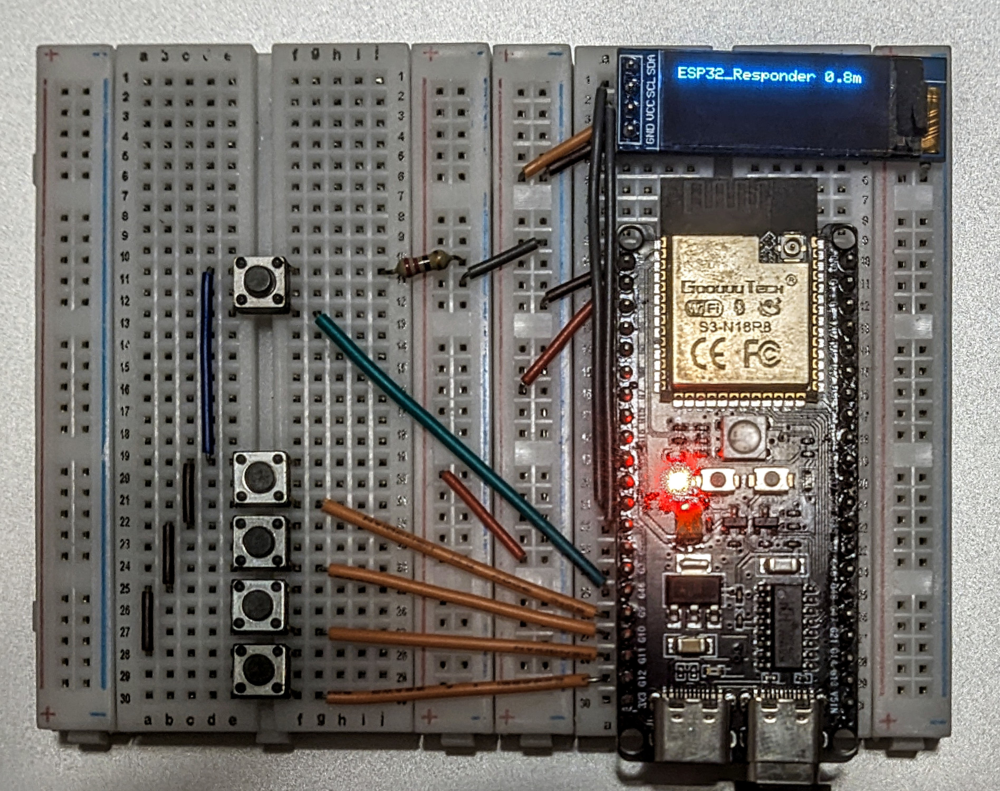
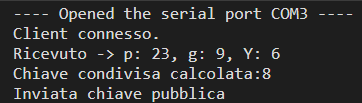

# Proximity OTP badge
## Abstract
We have multiple devices(things) scattered around in the space and some clients that wants to interact with those ones.  
The devices advertise their position constantly or at an interval depending on power settings and the client will scan for every advertising device.  
On connection with one of ths devices the clien will autenticate himself using a secure connection using a given identity present inside a pre-generated file contained inside the devices

### Tipical uses
This is a new type of active badge protocol developed to enshure maximum securety in critical infrastructure accesses, it uses a 2.4GHz antenna to determine the distance from any device, in this way it can guide an user to the designated point of interest, avoiding confusion on what point of interest an user wants to interact with. 

The secrecy of the comunication is granted by the use of DH key exchange method and the auth is done using an otp generator.

To fully secure the legittimacy of the code sent the OTP wil be presented to the user, that, after reading it, it is required to autenticate iself by applyng a transformation to the OTP generated (a secret that only the designated badge knows) and, in case of success, the access to the point will be granted. *(not yet implemented)*

### Some examples of implementations
The idea was to use this protocol to protect expensive farm/gardening equipment with the idea of preventing theft and avoid loosing small tolls.   

Nowdays farming equipment is more tecnologically advanced than ever, we have trailers fitted with all sort of tecnologies, starting from simple sensors to monitor the soil, coming up to arrays of GPUS capable of executing advanced computer vision algorithms. Every machine si really expensive(several time more than a luxury car usually), but, for some reasons, in each one of them, the only protection systems against theft or possible missuses, usually, is a lock (and the 5 to 10 ton weight of the machine to be honest). The most tecnologically advanced equipment might have some better securety systems, but they will still be proprietary systems with little to no possibility to be integrated in a ecosystem of sensor, requiring you to kno multiple "Secret codes" and/or carry multiple digital keys to operate them

Gardening equipment recently started following the same trend as the farming one, we have the same expensive devices usually left around or in a simple shed with minimal to no protection, lawnmower batteries that costs hundreds of dollars could be stolen in a matter of seconds and there is no system to find a tool that is lost(maybe in a pile of leaves or in the bed of a dump truck)

Thanks to the BLE communication that features really low power consumption and this protocol, we might be able to prevent all of this.
We can make a simple, chaep and versatile active key for exchanging small packets of data between device to track them and prevent their activation by users that are not supposed to have/operate them.

> Some other application scenarios might also be: managing access control to buildings, active badge tracking of users or advanced parcel localization in wharehouses and shipping containers.

## The protocol:
The protocol uses a simmetric key to exchange packets of data between 2 devices, every thing will contain a file, that can be updated, with a list of id-seed-counter that grants the clinet that wants to use and control it the ability to get autenticated.

I have developed this protocol using the key exchange protocol Diffie-Hellman or DH in short form, this granted the creation of a secret key k wich is used by the two entities to exchange informations.

After obtaining the key we proceed to create a random number using a PRNG, the PRNG on the client and thing sides, the generation is dictated by a counter sent by the device we wanna autenticate to. (this last feature is not implemented yet, at the moment we can autenticate only two devices toghether)

The generated key and otp are used to inzialize AES-CFB that will enshure complete encryption of the communication between the two devices and will mask patterns in repeated messages (the protocol will probably be used to send lots of similar small messages, so the CFB mode was the best)
Moreover the otp is always masked by the AES-CFB block encryption and is never shared, so an attacker will never be able to use it to get autentication on another device.

To get autenticated, the client sends to the device a message containing his name and an aes encrypted message that contains a challenge(TRNG number) and his name.   
In this way if the decryption is successfull and the name extracted is equal to the name sent by the client the protocol register a successfull autentication on the side of the thing.

After this the device adds one to the challenge and sends it back after encryption. If the client recieves the correct value after decryption, the autentication process is complete and the two parts now have confirmed their identity to eachother.

 

## HW Implementation
To implement this protocol i have used two ESP32s.
The device that represent the active badge and wants to connect to the thing will sens all devices in the area with their relative distance.  
Sensed devices wil be displayaed by an oled display and will be updated. (having only 3 lines we will display only the closest devices (higher RSSI strenght))

 

  

The thing is just a simple toggle switch for a light.