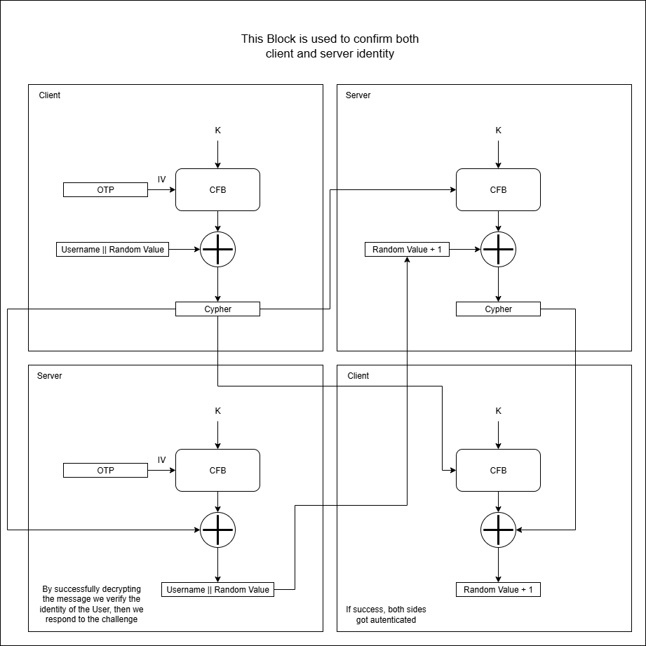

# Proximity OTP badge
## Abstract
This is a new type of active badge developed to enshure maximum secureti in critical infrastructure accesses, it uses a 2.4GHz antenna to determine the distance from any infrastructure access, in this way it can guide an user to the designated point of interest, avoiding confusion on what point of interest an user wants to interact with.  
It is also spoofing resistant having a system to detect if two point of interest are too close to eachother, so the request will not be forwarded in this case.  

The secrecy of the comunication is granted by the user of DH key exchange method and the auth is done using an otp generator.
To fully secure the legittimacy of the code sent the OTP wil be presented to the user, that, after reading it, it is required to autenticate iself by applyng a transformation to the OTP generated (a secret that only the designated badge knows) and, in case of success, the access to the point will be granted.

The idea was, initially, to use this protocol for farm equipment with the idea to protect expensive equipment from theft and from loosing smaller items in the field, but, thanks to the BLE communication that features really low power consumption, it might be used in any battery powered application and in a more portable badge form making it really versatile for exchanging small packets of data containing identification messages
> Some significative examples are: managing access control to buildings, active badge tracking of users or advanced parcel localization in wharehouses and shipping containers.

## The protocol:
I have developed this protocol using the key exchange protocol Diffie-Hellman or DH in short form, this granted the creation of a secret key k wich is used by the two entities to exchange informations.

After obtaining the key we proceed to create a random number using a PRNG on both sides

The generated key and otp are used to inzialize AES-CFB that will enshure complete encryption of the communication between the two devices and will mask patterns in repeated messages (the protocol will probably be used to send lots of similar small messages, so the CFB mode was the best)

To get autenticated, the client sends a message containing his name and an encrypted message that contains a challenge and his name.   
In this way if the decryption is successfull and the name extracted is equal to the name sent the client is autenticated for the server.

After this the server adds one to the challenge and sends it back after encryption. If the client recieves the correct value after decryption, the autentication is complete.

 

## Implementation
To implement this protocol i have used two ESP32s.
The device that rep